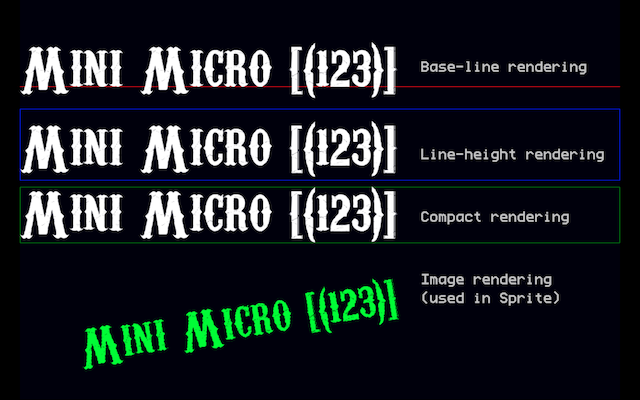
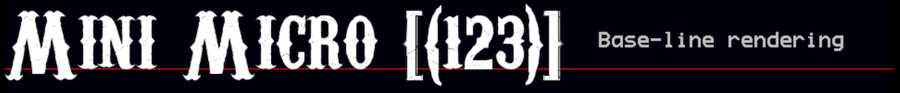
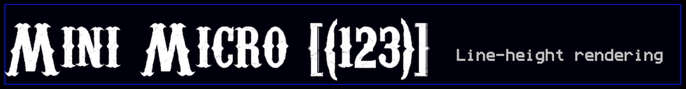
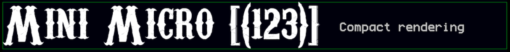

# BMFont Rendering for the Mini Micro

This library brings [BMFont](http://www.angelcode.com/products/bmfont/) rendering to the Mini Micro.

> **NOTE: not to be confused with the [BMF format](https://bmf.php5.cz/) for which another [Mini Micro library](https://github.com/JoeStrout/minimicro-fonts) exists. **

By converting TrueType fonts (TTF) to BMFont (see approaches below) rendering TTFs on Mini Micro becomes possible.



The BMFont standard consists of 1) a PNG file with the font glyphs (characters) and 2) a "descriptor" file describing the layout and properties of such glyphs.

> NOTE: there are different format alternatives for the "descriptor" file (txt, xml, bin, json, cbor). **This libary only supports "txt" (text).**

## Quick Usage

Sample code:

```
// (1) Import module
import "bmfontRendering"

// (2) Load font
font = bmfontRendering.loadFont("myBMFont.png", "myBMFont.fnt")

// (3) Instantiate a renderer
renderer = bmfontRendering.newBaseLineRenderer(gfx,font)

// (4) Render text
renderer.print str,20,20
```

Explanation:

1. The module `bmfontRendering` needs to be imported
2. Call the `loadFont` function, passing a path to the PNG (glyphs) file and a path to the text-based "descriptor" file (usually with ".fnt" extension, but possibly also ".txt"). This will return a `Font` instance.
3. Instantiate a "renderer". In this example a "baseline" renderer has been instantiated and the default "gfx" `PixelDisplay` was passed as a rendering "target".
4. Render text on the specified "target".

> NOTE: there are different types of renderers. See section below on this file for details.

The `Font` type provides these methods:

* `.resolveWidth(str)` returns the _width_ necessary to render the text specified
* `.resolveHeight(str)` returns the _height_ necessary to render the text specified
* `.resolveDimensions(str)` returns a map with fields `width` and `height`, representing the dimensions necessary to render the text specified

## Renderers

There are two main types of renderers:

* `TargetRenderer`
* `ImageRenderer`

### TargetRenderer(s)

`TargetRenderer` instances all offer the method:

```
.print textToRender,x,y
```

How the "y" coordinate is interpreted depends on the concrete renderer class.

Concrete "target renderers" are:

* `BaseLineRenderer`
* `LineHeightRenderer`
* `CompactRenderer`

#### BaseLineRenderer

`BaseLineRenderer` interprets the "y" coordinate as a baseline. The glyphs are rendered on that baseline. Parts of the text can be below that line, and usually above.



It can be instantiated with the module function:

```
.newBaseLineRenderer(target,font)
```

#### LineHeightRenderer

`LineHeightRenderer` renders the text inside an area as high as "line height" (as specified by the font definition). The "y" coordinate is the start of this area.



It can be instantiated with the module function:

```
.newLineHeightRenderer(target,font)
```

#### CompactRenderer

`CompactRenderer` calculates a minimal enclosing rectangle for the requested text, and renders it inside. The "y" coordinate points to the bottom of this rectangle.

It can be instantiated with the module function:

```
.newCompactRenderer(target,font)
```



### ImageRenderer

An `ImageRenderer` can be instantiated with the module function:

```
.newImageRenderer(font)
```

Note how a "target" is _not_ passed as a parameter.

In contrast to target-renderers, it does not "print" to a coordinate.

Instead, it offers this method:

```
.printToImg textToRender
```

This returns an `Image` with the text rendered. The size is just big enough to render the requested text (using a `CompactRenderer` behind the scenes).

## Generating Fonts

BMFonts can be generated from  TrueType fonts (i.e. ".ttf" files) using the methods described below. 

### 1. Using SnowB

There is an online tool ([source here](https://github.com/SilenceLeo/snowb-bmf)) to generate BMFont files here:

https://snowb.org/

Procedure:

1. Click on "ADD FONT FILE"
2. Select a local TTF file
3. Change the "Font Size" if needed
4. Click on "Export"
5. Change "Font Name" and "File Name" if needed
6. In the "Export Type" select either of the "BMFont TEXT" options
7. Click on "SAVE". This will generate and download a zip-file.
8. Extract that zip-file.

In there you will find a ".png" file for the glyphs and a ".fnt" (or ".txt") "descriptor" file.

You need these two files as the input for the library.

### 2. Using "fontbm"

This is a free open-source command-line utility which converts TrueType fonts to BMFont format.

The project's page can be found here:

https://github.com/vladimirgamalyan/fontbm

Windows and Linux versions can be found under ["Releases"](https://github.com/vladimirgamalyan/fontbm/releases). Build instructions for these operating-systems are also provided.

For MacOS, follow the [build instructions](https://github.com/vladimirgamalyan/fontbm#building-macos) on the page.

Sample usage:

```
fontbm --output freakshow --font-size 100 --font-file freakshow.ttf
```

This generates the ".png" glyphs file and a ".fnt" (text) descriptor file.

These files are needed as input for the library.

### 3. Other tools

If you are running Windows you can of course use the offical ["Bitmap Font Generator"](https://www.angelcode.com/products/bmfont/) tool from [AngelCode.com](https://www.angelcode.com/), which defined the standard.

It also includes interesting links to documentation and articles, and references other tools.

Among those other tools there is this Java-based UI solution:

https://libgdx.com/wiki/tools/hiero

Since the author of this library has not tested it, instructions are not included in this README.

## Credits

### Fonts

* [Carnivalee Freakshow Regular](https://www.1001fonts.com/carnivalee-freakshow-font.html) by [Chris Hansen](https://www.1001fonts.com/users/chrisx/) (free for personal and commercial use)
